# Full node client of smartBCH

This repository contains the code of the full node client of smartBCH, an EVM&amp;Web3 compatible sidechain for Bitcoin Cash.

You can get more information at [smartbch.org](https://smartbch.org).

We are actively developing smartBCH and a testnet will launch soon. Before that, you can [download the source code](https://github.com/smartbch/smartbch/releases/tag/v0.1.0) and start [a private single node testnet](https://docs.smartbch.org/smartbch/developers-guide/runsinglenode) to test your DApp.

[](https://golang.org/)
[](https://pkg.go.dev/github.com/smartbch/smartbch)
[](https://codecov.io/gh/smartbch/smartbch)


## Docker

To run smartBCH via `docker-compose` you can execute the commands below! Note, the first time you run docker-compose it will take a while, as it will need to build the docker image.

### First run the following to init the node:

```
make init
```

This will generate the test-keys and place them in test-keys.txt.
<br/>

### Next run the following to start your service:

```
make up
```
<br/>


### Stopping
You can stop your service by the following:

```
make down
```
<br/>


### Restart
This command will reset your docker container while keeping the volume.

```
make reset
```
<br/>


### Removing the volume
If you wish to remove your nodes data, simply delete the ```smartbch_data``` folder.

This may require sudo.

```
rm -rf smartbch_data/
```
<br/>


## Setting up multiple nodes

### First init the nodes
First we need to init the nodes to generate the genesis data, this script will initialize the node and add the
relevant seed information into the non-genesis node.

```
sudo make init-both

Expected output:

==============
Genesis Node
==============
Generating Keys
Creating network "smartbch_default" with the default driver
Creating smartbch_smartbch_genesis_run ... done

Init the node, include the keys from the last step as a comma separated list.
Creating smartbch_smartbch_genesis_run ... done

Genesis node Id: a53a8b00f4a70abae47db0130491cfac4a6d3dbd
Creating smartbch_smartbch_genesis_run ... done
Creating smartbch_smartbch_genesis_run ... done

Generate genesis validator
Creating smartbch_smartbch_genesis_run ... done
Creating smartbch_smartbch_genesis_run ... done
Copy genesis.json

Genesis node setup Finished!
==============
Sync Node
==============
Init chain id
Creating smartbch_smartbch_node_run ... done
preparing genesis file ...
saving genesis file ...
{"moniker":"sync_node","chain_id":"0x2711","node_id":"fc5c360eaf50b85ddb8a198c41f80aaa69471ea0","gentxs_dir":"","app_message":null}
Replace genesis.json
Configuring p2p seeds

Configuring RPC

Keys and genesis node id can be found at ./keys
Sync node setup Finished!
```

### Start the containers
After the nodes are initialized, we can start them with the following command:

```
make up-multi

Expected output:
❯ make up-multi                                                                                                                                                                                    11:17:39
docker-compose up -d
Creating smartbch_smartbch_genesis_1 ... done
Creating smartbch_smartbch_node_1    ... done

```

### Removing containers and cleaning volumes

In order to remove the leftover volumes, we can execute the following command:

WARNING: This will delete the volumes attached to your smartbch containers.

```
make clean

Expected output:
❯ make clean                                                                                                                                                                                       11:21:40
bash clean.sh
Are you sure? your data will be unrecoverable [y/n]
y
Stopping smartbch_smartbch_genesis_1 ... done
Removing smartbch_smartbch_genesis_1                ... done
Removing smartbch_smartbch_genesis_run_5d0f6254e045 ... done
Removing smartbch_smartbch_genesis_run_933bc0036c9a ... done
Removing smartbch_smartbch_genesis_run_a44d0c38f9b0 ... done
Removing smartbch_smartbch_genesis_run_95f3bb1a0309 ... done
Removing smartbch_smartbch_genesis_run_cec5442a1c34 ... done
Removing smartbch_smartbch_genesis_run_fb3d4c07a7bd ... done
Removing network smartbch_default
Cleaning previous node data
Done!

```


## Deploying a contract

### Install metamask
For this use case we will be using metamask, which can be used as a browser extension

Download at: [metamask](https://metamask.io/download.html)

If you do not have an existing wallet, follow the instructions to create a wallet.
Otherwise, import your wallet.

<br/>


## Remix
We will be using [remix](http://remix.ethereum.org/) to deploy our contract, as they have sample contracts available.

<br/>


## Connecting to node

<div align="center">
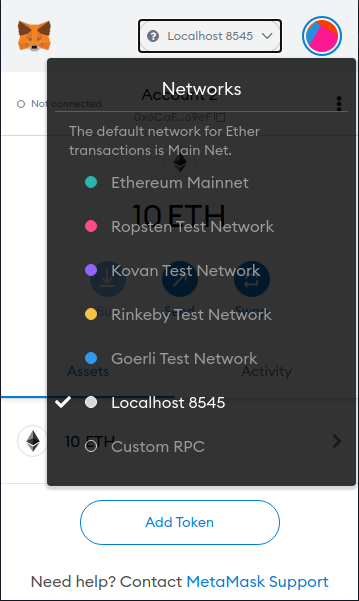

First we must select our network. Click the drop down in the top center of the extension and navigate to localhost.

<br/>

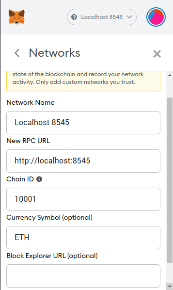

Next we must change the chain id of the network to match our testnet node. Change the chain ID from 1337 to 10001.

<br/>

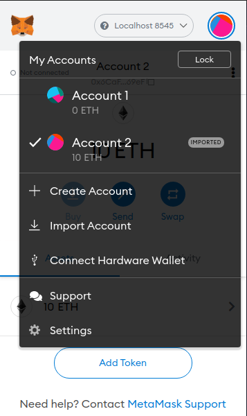

We must now import an account from our test-keys. Click the import account button.

<br/>

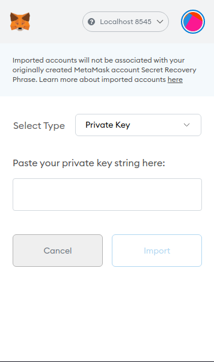

Paste one of the 10 keys from the test-keys.txt file into the private key field.
<br/>

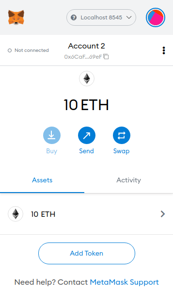

It should now show that you have 10 ETH
<br/>

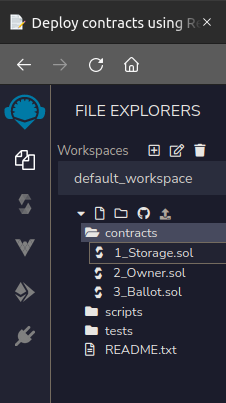

Navigate to the file explorer on the left side menu.

<br/>

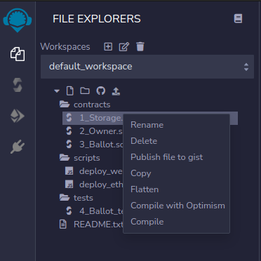

Next we need to compile a contract, you may be able to add your own contract into this menu however we will be compiling one of the examples provided. Right click a contract and select compile.

<br/>

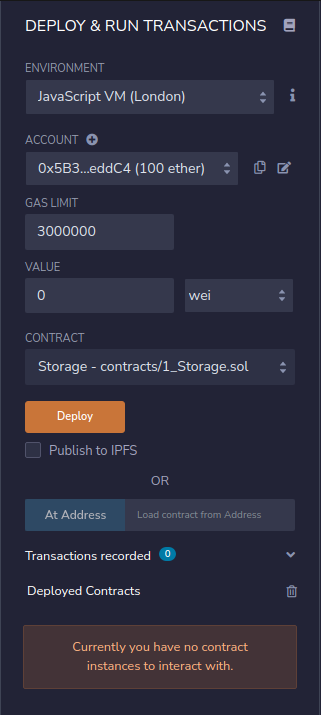

Navigate to the Deploy and Run transactions menu, the 4th icon down. Select Injected Web 3 in the environment drop down menu.
<br/>

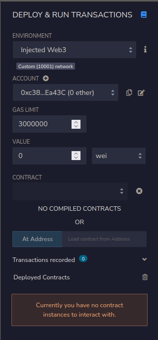

Now that we are on the injected web3 environment, select your compiled contract in the contract field if not already displayed, and select Deploy.

<br/>

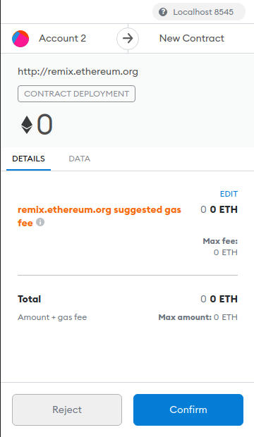


This will open the metamask extension, and show the initial contract configuration.
We need to edit the gas for our testnet to accept the transaction. Select EDIT in the middle of the scren. Next select edit again.

<br/>


The testnet node requires at least 10 GWEI for gas to be accepted. After changing the amount from 0, save the gas priority.

<br/>


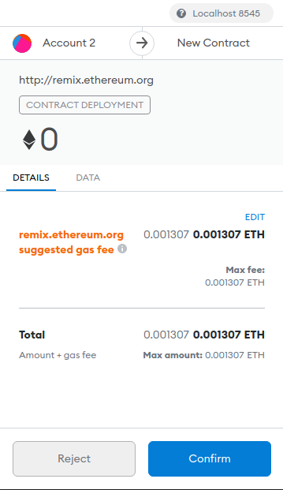

Now your contract should display the corrected gas amount, hit confirm to attempt to broadcast to the network.

<br/>


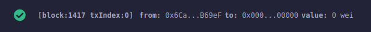

Upon a successful broadcast you should see this message in your console on the bottom of the remix page.

<br/>


